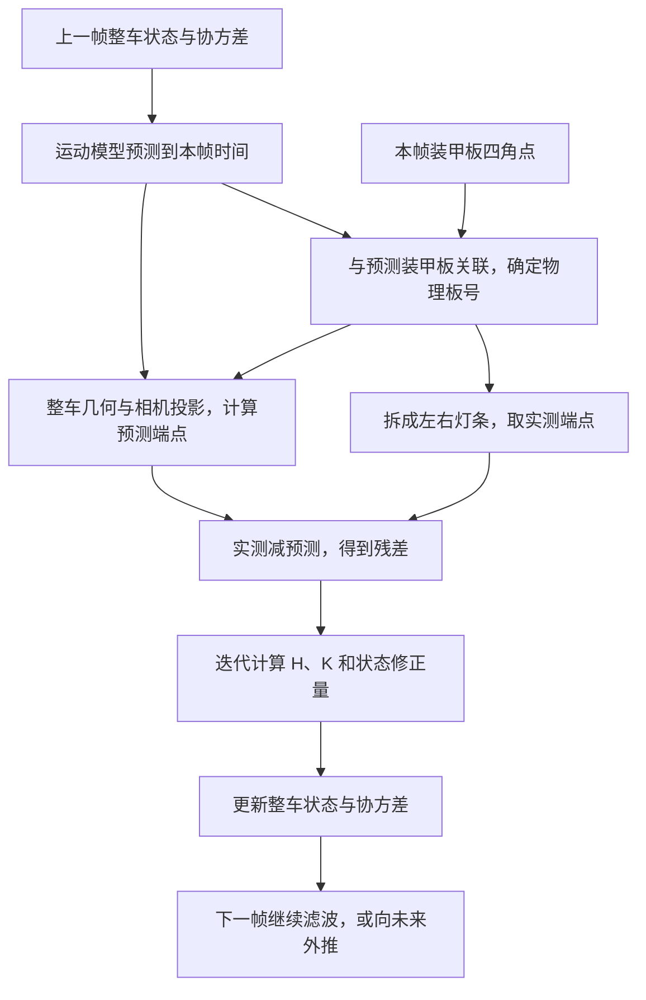

# newvision 如何预测：灯条端点观测与整车滤波器的配合

本文按当前工作区代码整理（2026-09-17），重点解释 `EskfTracker → EskfTarget → ErrorStateEkf` 这条实际使用的链路，最后说明滤波结果如何用于未来位置预测。

`newvision` 用检测到的灯条几何信息，持续校正一个 **13 维整车状态**；这个状态包含车心位置、速度、姿态、自转角速度、装甲板半径和高度差。随后，程序根据平动速度推进车心、根据角速度推进姿态，得到未来每块装甲板的位置。

其中，**灯条端点像素是观测，IESKF 是融合观测与运动先验的滤波器**。IESKF 即迭代误差状态扩展卡尔曼滤波器。两者通过一个“整车状态 → 预测灯条端点”的观测函数连接起来。

观测的写法取自 rmcs_auto_aim_v2：每根灯条直接观测上下两个端点的像素坐标。滤波器仍是本仓库从 awakening 移植的 13 维 IESKF，没有换成 rmcs 的 11 维普通 EKF。此前的版本把端点先折成 `[角度, 中心 u, 中心 v, 长度]`（UVL）再观测，已经删除，原因见第 3 节。

## 1. 先把一帧里的数据流串起来



这里需要区分三件事：

| 环节 | 解决的问题 | 主要代码 |
| --- | --- | --- |
| 关联 | 这次检测对应整车模型里的哪块板、哪根灯条？ | `matchArmor()`、`matchLight()` |
| 观测更新 | 这根灯条的实测端点与预测端点差多少，整车状态该怎样修正？ | `LightMeasure`、`updateMulti()` |
| 时间外推 | 按刚刚估计的运动状态，过一段时间整车会在哪里？ | `VehicleModel::Motion`、`EskfTarget::predict()` |

源码入口：[eskf_tracker.cpp](../src/l3_estimation/armor/eskf_tracker.cpp)（生命周期）、[armor_matcher.cpp](../src/l3_estimation/armor/armor_matcher.cpp)（关联）、[eskf_target.cpp](../src/l3_estimation/armor/eskf_target.cpp)（滤波）。

## 2. 滤波器里面保存的是什么

滤波器维护的是整车状态，所有关联到的装甲板共同约束这一份状态。

普通四板车的内部布局如下；表中的下标对应 `rawState()`：

| 下标 | 状态 | 含义 |
| --- | --- | --- |
| 0、2、4 | `CX, CY, CZ` | 车心／旋转参考中心在世界系的位置，单位 m |
| 1、3、5 | `VCX, VCY, VCZ` | 该中心的平动速度，单位 m/s |
| 6、11、12 | `ROT_Z, ROT_Y, ROT_X` | 整车姿态旋转向量的三个分量，单位 rad |
| 7 | `VYAW` | 绕车体自身 z 轴的角速度，单位 rad/s |
| 8 | `LOG_R1` | 第一组装甲板半径的自然对数 |
| 9 | `LOG_R2` | 第二组装甲板半径的自然对数 |
| 10 | `HEIGHT` | 奇数号板相对偶数号板的高度差，单位 m |

姿态由 `Exp([ROT_X, ROT_Y, ROT_Z])` 转成旋转矩阵。这三个数是旋转向量，不能直接当成欧拉角 roll、pitch、yaw；车辆存在倾斜时，这个区别会影响投影。

半径通过 `r = exp(LOG_R)` 取出，保证为正。对外的 `ekf_x()` 会将对应槽位转换成线性半径；四板车的第 9 项是第二组半径 `r2`，不能按旧模型读成 `r2-r1`。前哨站另有槽位复用：第 9、10 项表示另外两块板的高度偏移。

名义状态 `x` 就是当前的整车状态估计。滤波器还保存 `13 × 13` 的误差协方差 `P`，它既表达每个状态量有多不确定，也表达状态量之间的相关性。后者正是“图像观测能够更新速度”的关键。

源码：[vehicle_model.hpp](../include/l3_estimation/armor/vehicle_model.hpp)，重点看 `idx`、`vehicleRotation()` 和 `armorPose()`。

## 3. 一根灯条怎样变成观测

一根灯条输入两个图像端点，`toLight()` 按固定顺序排成四维向量：

```text
z = [u_t, v_t, u_b, v_b]ᵀ

top    = (u_t, v_t)
bottom = (u_b, v_b)
```

四个分量都是像素，残差就是逐维相减，没有角度缠绕要处理。图像 v 轴向下，所以正立的灯条 `v_t < v_b`。

一块完整装甲板的角点顺序是“左上、右上、右下、左下”，拆分方式是：

```text
左灯条 = points[0], points[3]
右灯条 = points[1], points[2]

一块完整板 → 两根灯条 → 两个 4 维端点观测
```

L2 的装甲板来自整板网络（同济 yolov5.xml，SP-Vision 同款），四个角点先经板 ROI 内的传统灯条精修（`ArmorRefiner`），找到可信的左右灯条才替换网络角点。所以即使没有侧边灯条，只要 L2 给出了完整装甲板的四角点，更新就能工作。

**类别（编号）。** 跟踪按编号筛观测，同一块板的编号一跳关联就断，所以编号有两条通路：整板网络的类别 argmax，以及可选的数字二次分类（`NumberClassifier`，rm_auto_aim 的 mlp.onnx）——在原图的板 ROI 上把两灯条之间的数字透视抠成 20×28 再判一次，`on_reject` 决定判不准的板是丢掉还是保留网络类别。`Armor::network_class_id` 和 `class_source` 记下两路的结果。默认关闭的原因见下面的配置表。

**为什么不再用 UVL。** UVL 的四个量（角度、中心、长度）全是同两个端点的函数，彼此并不独立。旧实现给它们配对角 `R`，等价于假设两个端点的误差强相关：垂直灯条方向相关系数约 0.88，即“整根灯条会整体横移，但倾角很准”。这个假设没有经过测量。直接观测端点时，两个端点的定位误差按独立处理，`R` 由端点噪声直接写出（第 7 节），也不用再为 `±π` 缠绕专门处理角度残差。

两种写法用到的信息相同：两个二维端点就是全部输入，换一种坐标并不增加信息，区别只在 `R` 怎样描述误差。

源码：[light_measure.hpp](../include/l3_estimation/armor/light_measure.hpp)，重点看 `toLight()`、`LightMeasure::operator()`、`lightCov()`；L2 一侧见 [armor_detector.cpp](../src/l2_perception/armor/armor_detector.cpp)。

## 4. 整车状态怎样生成“预测端点”

滤波器需要一个观测函数 `h(x)`：假设当前整车状态正确，相机应该看到怎样的灯条？

`LightMeasure` 持有 `LightContext`，其中包括物理板号 `id`、左右灯条标记 `is_left`、板数、装甲板尺寸、相机内参、畸变系数，以及本帧相机在世界系中的位姿。这些量为本次观测提供几何条件。

### 4.1 从车心展开指定装甲板

设车心为 `c`，车体到世界系的旋转矩阵为 `C`，车辆共有 `N` 块板：

```text
θ_i = 2πi / N

普通四板车：
  i 为偶数：r_i = r1，h_i = 0
  i 为奇数：r_i = r2，h_i = height_diff

第 i 块板在车体系的位置：
b_i = [-r_i cosθ_i, -r_i sinθ_i, h_i]ᵀ

第 i 块板在世界系的位置：
p_i = c + C b_i

第 i 块板到世界系的旋转：
C_i = C Rz(θ_i) Ry(armor_pitch)
```

代码里的板系 x 轴指向车心，朝外的正面是 `-x` 侧，所以位置公式前面有负号。常规车的 `armor_pitch` 为 `+15°`，前哨站为 `-15°`。

板号改变时，改变的是同一整车状态的几何展开方式；这使旋转中的装甲板切换可以继续约束同一个车体模型。

### 4.2 从板位姿投影灯条端点

设装甲板宽、高为 `w, h`。灯条端点在板系中的坐标由实物尺寸确定：

```text
左灯条：top = (0, +w/2, +h/2)，bottom = (0, +w/2, -h/2)
右灯条：top = (0, -w/2, +h/2)，bottom = (0, -w/2, -h/2)

T_camera_armor = inverse(T_world_camera) * T_world_armor
p_camera      = T_camera_armor * p_armor
```

将相机系端点 `(Xc, Yc, Zc)` 做透视投影，再应用畸变和内参，就得到预测端点。忽略畸变时，关系是：

```text
u = fx * Xc/Zc + cx
v = fy * Yc/Zc + cy
```

实际实现还计算径向与切向畸变，得到：

```text
z_hat = h(x) = [u_t_hat, v_t_hat, u_b_hat, v_b_hat]ᵀ
```

rmcs_auto_aim_v2 的解析雅可比只用了针孔模型；这里的 `H` 由滤波器对整条投影链做中心差分，畸变自然包含在内。

相机姿态与图像必须对应同一时间，否则云台运动会表现成错误的灯条残差，进而污染目标状态。runtime 按图像时间调用 `gimbalPoseAt(timestamp)` 查询姿态；查询超出姿态历史范围时，当前实现取历史端点值。

源码：[light_measure.hpp](../include/l3_estimation/armor/light_measure.hpp) 的 `projectPointsOf()`，以及 [projection.hpp](../include/l6_telemetry/projection.hpp)。

### 4.3 这些图像量怎样约束三维状态

两个端点一起平移提供图像位置约束；两个端点沿灯条方向反向移动（灯条变长或变短）、左右灯条间距提供尺度与深度线索；两个端点垂直灯条方向反向移动（灯条倾斜）、左右灯条的长度差和位置关系提供姿态线索。近正对时，灯条倾角对整车 yaw 的一阶敏感度约为 `tan15° ≈ 0.27`，而板宽缩短的一阶敏感度为零，所以这时 yaw 主要靠倾角观测。

这些约束是耦合的。例如，预测灯条偏短，可能来自距离偏远，也可能来自姿态偏差。滤波器会结合全部灯条、状态之间的相关性和历史运动先验共同求修正量。不能把某一个残差分量机械地指定给某一个状态量。

## 5. 新观测进入前，滤波器先预测到本帧

`EskfTracker::updateTarget()` 先调用 `predictEkf(timestamp)`，再做关联和观测更新。

设上一帧状态时刻为 `t_prev`，本帧为 `t_image`：

```text
dt = t_image - t_prev

车心：c_minus = c_prev + v_prev * dt
速度：v_minus = v_prev
姿态：C_minus = C_prev * Exp([0, 0, ω*dt]ᵀ)
角速：ω_minus = ω_prev
```

这是恒速度平移、绕车体 z 轴恒角速度旋转的模型。半径和高度差的名义值通常保持，实际代码还包括半径约束、前哨站固定转速等特殊处理。

同时，误差协方差推进为：

```text
P_minus = F P_prev Fᵀ + Q
```

`F` 描述状态误差如何随运动传播；`Q` 表达未建模加速度、角加速度和几何漂移带来的不确定性。当前 `F` 通过 `ceres::Jet` 对误差状态传播链求导。

这一步得到本帧更新前的先验 `x_minus, P_minus`。后面的端点观测负责修正它们。

距上次成功更新超过 `ieskf.temp_lost_predict_ms`（默认 100 ms）以后，运动只积分到截止时刻，之后车心和姿态原地保持；`Q` 仍按完整的 `dt` 累加，位置不确定度照常变大。原因见 6.5 节。

这里的“本帧时刻”指传入的图像时间戳。当前海康与迈德威视驱动在取到 SDK 图像缓冲后用主机时钟打戳，还没有把它严格换算成硬件曝光中点；时间同步精度会直接影响观测与预测是否对齐。

## 6. 先关联，再把观测装进滤波器

### 6.1 为什么需要物理板号

同一根检测灯条若配给 0 号板左灯条、1 号板右灯条，会得到完全不同的 `h(x)`。滤波更新以前，必须确定它对应哪一个几何部件。

当前完整装甲板关联流程是：

1. 保留与跟踪目标类别相同的检测。
2. 根据先验整车状态生成候选板，按朝向相机的程度保留最多三块。
3. 将候选板投影成四边形，与检测四边形计算中心误差、边方向误差和周长比例误差。
4. 超出门限的组合排除，其余做贪心一对一匹配。

关联门限决定观测是否进入更新；观测协方差 `R` 决定进入以后占多大权重，两者承担不同职责。

### 6.2 一次更新可以包含多少维观测

`EskfTarget::update()` 为每根灯条创建一个观测对象：

```cpp
Filter::makeObs<4>(z, measure, update_R, residual_func)
```

这四个部分分别提供实测端点、观测函数 `h(x)`、噪声协方差和残差算法。最后一次性调用 `filter_->updateMulti(observations)`。

观测按以下顺序拼接：完整板拆出的灯条、侧边灯条、可选的单板深度差。灯条块连续排放，更新后按下标就能把残差拆回每根灯条。

| 本帧观测组合 | 总维数 m | H 的尺寸 | K 的尺寸 |
| --- | --- | --- | --- |
| 一块完整板，仅端点 | 8 | `8 × 13` | `13 × 8` |
| 一块完整板，加深度差 | 9 | `9 × 13` | `13 × 9` |
| 两块完整板 | 16 | `16 × 13` | `13 × 16` |
| 一块完整板、深度差、一根侧边灯条 | 13 | `13 × 13` | `13 × 13` |

一般而言，`m = 4 × 灯条数 + 可选深度差的1维`。13 个观测分量不保证 13 个状态都能独立确定，还要看几何是否退化以及 `H` 的秩。

### 6.3 PnP 在这条链路里的作用

初始化时，`single_pnp()` 提供第一块板的位姿，程序将它标为 0 号板，结合半径先验反推车心。普通车默认初始半径为 `0.26 m`，初始速度、角速度为零，后续通过跨帧更新估计。

正常跟踪主要使用上述端点观测。当本帧只关联到一块完整板时，程序还尝试从 IPPE 得到一维辅助观测：

```text
z_depth = 左灯条中心的相机深度 - 右灯条中心的相机深度
```

`DepthDiffMeasure` 从整车状态预测同一深度差，残差仍是实测减预测。这个量补充斜视姿态约束。PnP 失败时不加入这 1 维，完整板的端点观测仍可更新；两块及以上完整板时不加入这项。

深度差由同一块板的图像角点导出，与这块板的端点观测相关；当前块对角 `R` 没有表达这类跨观测相关性。

### 6.4 侧边灯条的来源与关联门限

整板网络同时看到两块板时，侧面那块常常检不出，侧边灯条补的就是这块信息。

**来源（L2）。** 跟踪中 `EskfTracker::lightRoi()` 给出整车预测框放大 1.6 倍的 ROI，`ArmorDetector::detectFrame()` 在其中用 `findLights()` 的传统二值化找灯条（灰度或颜色差分二值化 → 外轮廓 → 最小外接矩形 → 长度/长宽比/倾角筛选 → `lightColor` 判色）。随后剔掉中心落在任一检出装甲板外接框（外扩 `armor_margin` 倍灯长）内的灯条：它们已经作为板的角点进了观测。剩下的放进 `ArmorFrame::lights`。

> 曾经还有一路 YOLOv8n-pose 灯条关键点模型（`light_finder.mode` 的 `model` / `hybrid`）。2026-09-19 在八段录像上 A/B 后删掉了：灯条产出量传统检测不输模型、预测精度各赢四段且 p50 差都在 0.6 px 以内，而模型让 L2 单帧从 7.2 ms 涨到 20.7 ms。数据见 `docs/replay_ab_log.md` 的侧边灯条一节。

> `findLights()` 的三个几何门（`min_ratio` / `max_angle_deg` / `min_length_px`）保持 FYT 原值，很松：4 px 长、短边只占长边 8% 的斑点也算灯条，检出的大半是数字笔画、光晕和背景轮廓。2026-09-20 在八段录像上扫过两档收紧，结论是**误识别确实多，但不要紧，因为它们全死在 `matchLight` 的门里**：
>
> | 档位 `min_ratio` / `max_angle_deg` / `min_length_px` | 候选 3m_high / 3m_run_mid | 采纳 | 预测 p50 |
> | --- | --- | --- | --- |
> | 0.08 / 40° / 4 px（现值） | 3877 / 5093 | 588 / 936 | 基线 |
> | 0.12 / 30° / 8 px | 3359 / 3509 | 588 / 936 | 八段中六段逐位相同 |
> | 0.15 / 25° / 10 px | 2996 / 3121 | 588 / 936 | 低曝光两段开始掉 |
>
> 候选砍掉两到四成，采纳数一根不变，预测误差逐位相同；单帧耗时也测不出差别（3m_run_mid：L2 6.98 → 7.19 ms、L3 0.267 → 0.274 ms，都在运行间噪声里）。再紧一档就开始吃真灯条——低曝光的 `fast_stop` 采纳 321 → 292、p50 19.452 → 19.511。所以保持原值：要压住侧边灯条带来的噪声，该动的是关联门或曝光，不是这里。

**关联（L3，`matchLight()`）。** 侧边灯条没有类别证据，错配比漏配代价高，门限都是硬拒绝：

1. 本帧至少关联上一块完整板；基地不用；`light_match_require_jumped` 为真时，还要求目标见过 0 号以外的板。在那之前，整车 yaw、第二组半径和高度差几乎不可观测，邻板灯条的预测位置是猜的。
2. 候选槽位只有最正对那块板的左右灯条，以及两块邻板靠近它的各一根。已配成完整板的板、背对相机的板不参与。
3. 与预测灯条的长度比、角度差不超过 `light_match_length_ratio_gate`、`light_match_angle_gate`。
4. 先验点上的马氏距离 `rᵀS⁻¹r ≤ light_match_chi2_gate`，其中 `S = H·P·Hᵀ + R`，4 自由度，默认 13.28（99% 分位）。`R` 就是这根灯条若被采纳时进更新的那份，含 `isolated_light_sigma_scale`。它随距离和滤波器不确定度自动缩放：预测越准，放进来的范围越小。收敛后，同一根灯条平移两倍灯长就会被拒，而旧的“两端点距离和不超过 5 倍灯长”像素门限会放行。
5. 通过的按马氏距离贪心一对一配对。

注意刚初始化时 `P` 很大，卡方门限几乎不设防，所以第 1 条的 `require_jumped` 不能省。

各道门毙掉多少，`track_diag` 按 `EskfTracker::lightMatchStats()` 逐项打印。调门限前先看这一行：采纳数为零时，它区分得开「候选槽位根本没开出来」和「某道门收太紧」。以 `records/3m_high` 为例（armor.xml，2960 帧，L2 检出 3877 根）：2960 帧里 644 帧没锚板、481 帧没候选槽位，真正进到逐对比较的只有 3287 对，其中长度门毙 2123、角度门毙 538、卡方毙 14，最后 588 根进了更新。**长度门是主要出口，不是卡方门。**

> 试过再加两道以本帧网络检出的完整板（锚板）为基准的门：灯条长度要与锚板同侧灯条相近，以及把锚板那根灯条按模型转过 2π/N 之后要落在侧边灯条附近（整车位置估偏是共模，两个预测相减抵消，剩下的只有 yaw 和两组半径之差的误差）。2026-09-20 在八段录像上 A/B 过，**没用，已回退**：
>
> - 门限取 0.25 / 1.5 倍灯长时，它毙掉的恰好是卡方门本来就要毙的那 14 对，八段里三段逐位相同、两段更好、三段更差，最大一笔是 `3m_run_fast` 3.990 → 4.426 px。
> - 收紧到 0.15 / 1.0 会真的开始拒（3m_high 多毙 201 对，采纳 588 → 389），八段里三好五坏，`3m_run_no` 的采纳量直接从 162 塌到 14。
> - 用锚板长度**替换**预测长度（`light_match_length_ratio_gate` 关掉）也是四好四坏，`3m_run_fast` +0.33 px 一笔就吃掉全部收益。把长度门整个关掉更糟：3m_high 采纳 588 → 1248，p50 1.556 → 2.120。
>
> 结论是过了现有三道门的灯条本来就已经满足这两条几何约束，再收只会丢掉好观测；预测长度比锚板的实测长度更适合当基准——前者来自收敛后的深度估计，平滑；后者是逐帧的检测噪声，还带着邻板与锚板的真实深度差（3 m 处约 ±8%）。唯一的反例是 `3m_mid`（过曝、侧边灯条本来就帮倒忙那一段）：收到 0.15 / 1.0 能把 1.317 拉到 1.099，逼近「侧边灯条整个关掉」的 0.938。精度与召回在这两段录像上要的方向相反，一个标量门限调不出两全。

`AutoAimRuntime` 与 `daedalus_vehicle_prediction` 都调用 `detectFrame()`，把完整板和侧边灯条一起传给 `track()`。是否使用侧边灯条，由 `ieskf.enable_lights_measure` 决定。

### 6.5 目标暂丢、断流与重建

关联按预测位置做，所以预测一旦跑偏，同一块板回来了也配不上。sp_vision 的 demo（`sp_vision_25-main/assets/demo/demo`）上出现过两种跑偏：

- 一次错关联把 `v_yaw` 拉到 −2.23 rad/s，之后十几帧没有更新，匀速外推把整车转出画面，框偏 1300–4300 px；
- 录像拼接处 `dt` 为 1 s 和 82.6 s，照样按旧速度外推。

对应的处理：

| 情况 | 处理 |
| --- | --- |
| 相邻两次 `track()` 间隔超过 `max_frame_gap_ms`（默认 100 ms），或时间倒退 | 两个槽全部复位，本帧按 Lost 用当前检测重建；与 sp_vision 的 `dt > 0.1 s` 判 lost 一致 |
| 超过 `temp_lost_predict_ms` 没有更新 | 停止外推，目标停在截止时刻的位置（第 5 节） |
| 当前目标 TempLost 时 | 备用槽优先拿同类别的板建目标：同一阵营里一个编号只对应一辆车 |
| 外推已停住，备用槽又建出了同类别的目标 | 直接换上来，保留它的 Detecting 状态和计数；输出立刻跟到板上，转 Tracking 之前 L5 仍不开火 |
| 当前目标本帧被丢弃（Detecting 丢帧、TempLost 超时、发散） | 同一帧就用本帧检测重建，不空等一帧；丢弃次数由 `EskfTracker::dropCount()` 累计 |

## 7. R 怎样表达“这次观测有多可信”

`R` 是观测噪声协方差，和描述整车状态误差的 `P` 位于不同空间。端点观测的四维都是像素，`R` 描述的就是端点定位误差。

设本根灯条的实测长度为 `L`，噪声缩放系数为 `s`：完整板拆出的灯条取 `s=1`，侧边灯条取 `isolated_light_sigma_scale`（默认 1.4）。每个端点的误差在灯条自身坐标系里分两个方向：

```text
σ∥ = max(sigma_min_px, sigma_along_by_length · L) · s
σ⊥ = max(sigma_min_px, sigma_perp_by_length  · L) · s

e = (bottom - top) / |bottom - top|      灯条方向（图像系）
Σ = σ∥² e eᵀ + σ⊥² (I - e eᵀ)            一个端点的 2×2 协方差

R_light = blockdiag(Σ_top, Σ_bottom)     上下端点互相独立，Σ_top = Σ_bottom = Σ
```

**当前默认是 rmcs_auto_aim_v2 的写法**：两个系数为 0、`sigma_min_px = 6.32`，即各向同性常数 `R_light = 40·I`（px²），不随距离变化。由端点噪声换算，中心 σ 为 `σ/√2 ≈ 4.5 px`，长度 σ 为 `√2·σ ≈ 8.9 px`，倾角 σ 为 `√2·σ / L`，`L=30 px` 时约 0.30 rad。

两个系数非零时是各向异性写法。例如 `sigma_along_by_length=0.32`、`sigma_perp_by_length=0.20`，一根竖直、`L=30 px` 的灯条（`e=(0,1)`）：

```text
σ∥ = 9.6 px，σ⊥ = 6.0 px
Σ       = diag(36.0, 92.16)
R_light = diag(36.0, 92.16, 36.0, 92.16)
```

灯条倾斜时 `Σ` 带非零的 `u、v` 协方差，但在灯条坐标系里仍是对角的。

取值依据（2026-09-17，`track_diag` 四段 3 m 录像，灯条 25–34 px）：

| R 写法 | 结论 |
| --- | --- |
| rmcs 常数 6.32 px | 四段的 100 ms 开环预测误差和未换板瞄准点抖动都优于改动前的 UVL，3m_run_fast 上没有重置，综合最好 |
| `0.32 / 0.20 × L` | 与 rmcs 常数基本持平；3 m 处两者量级相同，分不出“常数”与“按长度缩放”的差别 |
| `0.16 / 0.10 × L` | 按旧 UVL 配置（0.2 / 0.5 / 0.1，完整板除以 4）的边缘方差换算；3m_run_fast 优于旧 UVL，其余三段不如 |
| `0.16 / 0.05 × L` | 更信倾角，四段都更差 |
| `0.20 / 0.20 × L` | 与 rmcs 常数接近，3m_run_fast 上重置 1 次 |

各组 NIS/dof 都远小于 1（0.03–0.5），说明 `Q`、`R` 整体偏大，这与过程噪声有意放大换响应速度的取舍一致；目前 `R` 大一些反而更平滑，也更稳。

按长度缩放的物理依据仍然成立：灯条长度与距离成反比，σ 正比于长度相当于物理尺度上的噪声近似恒定，近处随像面放大的模型误差（外参、板几何、时间同步）也一并吸收；沿灯条方向端点落在亮度渐变处，定位比垂直方向差。录像换到别的距离后，应当重新比较这两种写法。

侧边灯条的 1.4 沿用旧配置里完整板除以 4、独立灯条除以 2 的相对差别。旧配置的“除以 split”只是按回放定的等效权重，端点观测里已经去掉。

各根灯条及深度差之间按块对角拼接：

```text
R_all = blockdiag(R_light_0, R_light_1, ..., R_isolated_0, ..., R_depth?)

R_depth = armor_lights_depth_diff_sigma² / 2
```

增大某类观测的 `R`，通常会降低滤波器对该类残差的响应；增大运动过程噪声 `Q`，通常会使先验更不确定、更愿意接受新观测。实际修正方向和大小仍取决于整个 `P、H、R`，并非单一权重。

## 8. 残差怎样变成整车状态的修正量

这是观测与滤波器配合的核心。以下对应 [error_state_ekf.hpp](../include/l3_estimation/filter/error_state_ekf.hpp) 中的 `updateMulti()`。

### 8.1 先计算图像残差

```text
e = z - h(x)
```

例如，一根灯条的实测与预测端点为：

```text
实测：top=(100,90)，bottom=(100,110)
预测：top=(98,91)， bottom=(98,109)

z     = [100, 90, 100, 110]ᵀ
z_hat = [ 98, 91,  98, 109]ᵀ
e     = [  2, -1,   2,   1]ᵀ
```

投到灯条坐标系（方向 `e∥=(0,1)`，法向 `e⊥=(-1,0)`）更容易读：两个端点的垂直分量都是 `-2`，同向，说明整根灯条比预测偏右 `2 px`；沿灯条分量上端点 `-1`、下端点 `+1`，反向，说明实测灯条比预测长 `2 px`。`track_diag` 的 `res_along_px`、`res_perp_px` 两列就是这两个方向的 RMS。

修正整车状态需要知道：车心、姿态或半径稍微变化时，预测端点会怎样移动？这由 `H` 回答。

### 8.2 H 是整车误差到图像变化的局部映射

用 `δ` 表示 13 维误差状态，`⊞` 表示把误差注入名义状态：

```text
x_eval = x_minus ⊞ δ
H      = ∂h(x_minus ⊞ δ) / ∂δ
```

`H` 的一列对应某个状态误差的影响，一行对应某个观测分量。例如，车心横向位置变化会影响灯条的 `u`；车体转动会同时影响两根灯条的位置、长度与方向。

当前观测更新用中心差分计算 `H`，每个误差维度的扰动量为 `ε=1e-6`：

```text
H[:, j] ≈ -[e(δ + ε e_j) - e(δ - ε e_j)] / (2ε)
```

这里 `e_j` 表示第 j 维的单位向量。前面的负号来自残差定义 `e=z-h(x)`。滤波器差分的是残差函数而不是 `h(x)`，这对端点观测没有区别，是为了让带角度缠绕的观测也能直接接入。

运动预测的 `F` 使用自动微分；这里的观测 `H` 使用数值差分，两者不要混淆。

### 8.3 K 综合先验、几何敏感度与观测噪声

同帧所有观测的残差和 `H` 纵向堆叠，`R` 按块对角拼接，然后计算：

```text
S = H P_minus Hᵀ + R
K = P_minus Hᵀ S⁻¹
```

`S` 表示预测观测与测量噪声共同造成的残差不确定性。`K` 把图像空间的残差映射到状态空间：m 维残差，经 `13 × m` 的增益矩阵，变成 13 维状态修正量。实际代码通过 LDLT 解线性方程，不显式求逆。

像素残差之所以能修正以米、米每秒、弧度表示的状态，是因为 `H` 描述了投影的单位转换和敏感度，`P` 与 `R` 又给出了对应的不确定性。

### 8.4 同一帧为什么要迭代

观测函数包含旋转、透视除法和畸变。先验偏离观测时，一次线性化可能不够，所以每轮在新的误差估计处重新计算预测端点、残差、`H` 和 `K`。

当前默认的迭代式是：

```text
δ_0 = 0

第 j 轮：
  x_j     = x_minus ⊞ δ_j
  e_j     = residual(h(x_j), z)
  H_j     = 在 δ_j 处求观测雅可比
  K_j     = P_minus H_jᵀ (H_j P_minus H_jᵀ + R)⁻¹
  δ_(j+1) = K_j (e_j + H_j δ_j)
```

`ieskf.iteration_num` 默认是 `5`。当前实现固定执行配置的轮数，没有根据残差大小提前退出。取 `1` 就是普通 EKF 的批量更新。

rmcs_auto_aim_v2 的做法是普通 EKF 逐根灯条顺序更新：每根灯条更新完就按新状态重新投影，再处理下一根，效果上相当于把重新线性化分摊到各根灯条上。这里是一帧所有灯条一起、在同一个先验上迭代。

迭代期间，实测 `z`、关联到的板号和先验 `P_minus` 保持不变；变化的是线性化位置。`H_j δ_j` 让修正量始终相对于同一个先验计算。它可以理解为在以下目标上做局部迭代：

```text
J(δ) = δᵀ P_minus⁻¹ δ
     + residual(h(x_minus ⊞ δ), z)ᵀ R⁻¹
       residual(h(x_minus ⊞ δ), z)
```

第一项约束偏离运动先验的程度，第二项约束图像拟合误差。五轮迭代是在反复改进同一帧的解，而非把这张图当五次独立测量。

累加式 `δ += K*e` 的分支已经从 `ErrorStateEkf` 删掉：它从来没被打开过，而迭代次数一多，它的偏差会复利放大（见 `docs/iterated_ekf.md`）。

### 8.5 最后怎样写回状态和协方差

迭代结束后，将最终误差注入名义状态：

```text
x_plus = x_minus ⊞ δ_final

普通数值分量：相加
姿态：C_plus = C_minus * Exp(δ_rotation)
半径：先更新 log(r)，读取时再 exp()
```

姿态使用右乘旋转更新，所以误差转动在车体系中表达。然后清零误差状态，用最后一轮的 `K、H、R` 更新协方差：

```text
P_plus = (I-KH) P_minus (I-KH)ᵀ + K R Kᵀ
P_plus = (P_plus + P_plusᵀ) / 2
```

这是当前代码采用的 Joseph 形式及对称化操作。协方差只在循环结束后更新一次，下一帧从新的状态和协方差继续预测。

## 9. 端点观测没有速度，为什么能估出速度

`LightMeasure` 对应的观测函数 `h(x)` 直接使用车心、姿态、半径和高度差，不直接读取平动速度或 `VYAW`。因此单帧观测雅可比中，这些速度维度的列为零。

速度更新来自预测步骤建立的相关性：

```text
位置预测依赖速度 → P 中出现位置—速度相关性
姿态预测依赖角速 → P 中出现姿态—角速度相关性

图像约束位置／姿态 → K 利用上述相关性，同时修正速度／角速度
```

用一个只保留位置 `p` 和速度 `v` 的教学例子说明。假设某个图像中心分量对位置的导数为 `2 px/m`，本帧先验和观测为：

```text
x = [p, v]ᵀ
P_minus = [1.0  0.3]
          [0.3  2.0]
H = [2, 0]
R = [1]
图像残差 e = 2 px

S = H P_minus Hᵀ + R = 5
K = P_minus Hᵀ / 5 = [0.40, 0.12]ᵀ

δp = 0.40 * 2 = 0.80 m
δv = 0.12 * 2 = 0.24 m/s
```

这是为了展示矩阵关系而选的数字。即使 `H` 的速度列是零，`P` 的位置—速度交叉项也能使速度对应的增益非零。三维整车中的平动速度、自转角速度，沿着同样的机制被跨帧观测修正。

这也解释了初始化后需要积累观测：第一张图能给几何初值，稳定的运动估计来自后续的预测与更新。

## 10. 滤波结果如何用于未来预测

`EskfTracker::track()` 向下游返回 `snapshot()`，其中包含名义状态与时间戳，不包含内部滤波器。下游的 `predict()` 只推进这份状态及其时刻，不传播内部协方差。

对普通车辆，向前预测 `Δt` 的主要公式仍是：

```text
c_future = c_now + v_now * Δt
C_future = C_now * Exp([0, 0, ω*Δt]ᵀ)

p_i_future = c_future + C_future b_i
```

在车体水平、只绕竖直轴转动的简化情形下：

```text
ψ_future = ψ_now + ω*Δt
θ_i      = ψ_future + 2πi/N

x_i = cx_future - r_i*cosθ_i
y_i = cy_future - r_i*sinθ_i
z_i = cz_future + h_i
```

例如，先固定 0 号板看几何：车心为 `(5,0,0) m`、速度为 `(0,1,0) m/s`、初始 yaw 为 0、角速度为 `10 rad/s`、半径为 `0.26 m`。经过 `100 ms`：

```text
车心从 (5,0,0) 变成 (5,0.1,0)
车体转过 1 rad，约 57.3°
0 号板从 (4.74,0,0) 变成约 (4.8595,-0.1188,0)
```

车心向正 y 方向移动，这块板却因旋转移向负 y 方向。必须同时推进平移与旋转，才能得到这样的结果。

下游两个入口使用不同的预测时长：

| 入口 | 预测时长如何确定 | 输出 |
| --- | --- | --- |
| `daedalus_vehicle_prediction` | `--predict-ms` 指定，默认从目标状态时刻向前 100 ms | 绿色当前整车与橙色未来整车 |
| `AutoAimRuntime → Planner` | 图像到发射的延迟，加弹丸飞行时间 | 命中点、实体板号和 yaw/pitch |

实机规划使用：

```text
before_fire = image_to_plan + plan_to_send
            + send_to_control + control_to_fire

t_hit = target.t() + before_fire + fly_time
```

`Planner` 先外推到发射时刻，再根据飞行时间外推到命中时刻并重新选板、解弹道。飞行时间依赖目标位置，所以循环求解，当前默认最多 10 轮、相邻飞行时间差小于 1 ms 时退出。达到上限时保留最后一轮解，没有单独的“未收敛”拒绝状态。当前每轮会重新选板，弹道用 `planner.cpp` 内的真空解析解。

这里的时间链仍有实现上的近似：`image_to_plan` 依赖前述图像时间戳口径；`plan_to_send` 用上一帧从规划开始到 runtime 计时点的耗时估计，计时包含启用时的叠加绘制，串口线程实际写出的时刻没有直接回灌。预测效果同时受状态估计和时间链精度影响。

源码：[predictor.cpp](../src/l4_planning/armor/predictor.cpp)、[planner.cpp](../src/l4_planning/armor/planner.cpp)、[auto_aim_runtime.cpp](../src/runtime/auto_aim_runtime.cpp)。

## 11. 阅读日志和配置时要注意什么

当前 runtime 创建的是 `EskfTracker`，使用 [auto_aim.yaml](../config/auto_aim.yaml) 中的 `ieskf` 参数。文件里仍保留旧的 `estimator` 和 `tracker` 参数，但这条 IESKF 运行链路没有将它们作为自身噪声和生命周期配置。

| 参数或现象 | 应怎样理解 |
| --- | --- |
| `ieskf.iteration_num` | 一帧观测重新线性化的轮数，默认 5；与 L4 飞行时间迭代无关 |
| `body_acceleration`、`yaw_acceleration` | 影响运动先验的过程噪声；默认 `[30,30,1]` 和 `30` |
| `sigma_along_by_length`、`sigma_perp_by_length`、`sigma_min_px` | 端点沿灯条、垂直灯条两个方向的像素噪声，默认是 rmcs 的常数 6.32 px；垂直方向同时决定对灯条倾角（近正对时的 yaw）的信任程度 |
| `isolated_light_sigma_scale` | 侧边灯条两个 sigma 的放大系数 |
| `light_match_chi2_gate`、`light_match_require_jumped` | 侧边灯条关联的卡方门限与启用条件，见 6.4 节 |
| `number_classifier.enable` | 数字二次分类，默认关。mlp.onnx 只认 1~5、前哨、哨兵、基地九类：在四段自录上它与网络的类别 100% 一致（等于不起作用），在 sp demo 上却把 58% 的检出判成 negative（那块手持哨兵板的图案不在它的九类里），`on_reject: drop` 会连着整辆车的观测一起筛掉。换了识别模型或场地出现编号跳变时再开，开之前先用 track_diag 看"数字分类采信/丢弃" |
| 关联板号反复变化、车体姿态突跳 | 先检查完整板的几何关联与角点质量 |
| 端点残差沿灯条／垂直灯条分量偏大 | 前者偏尺度（深度、高度），后者偏横向位置和姿态；这些量耦合，不能一项残差唯一定位原因 |
| 没有完整板匹配，进入 `TempLost` | 先按运动模型预测，超过 `temp_lost_predict_ms` 后原地保持，超过 `lost_time_thres` 放弃；L5 拒绝开火，见 6.5 节 |
| `max_frame_gap_ms`、`temp_lost_predict_ms` | 断流复位的帧间隔和停止外推的时刻，YAML 里写毫秒 |
| 预测框越来越偏 | 同时检查关联、标定、图像与姿态同步，以及恒速度模型是否适合当前运动 |

`EskfTracker::usedLights()` 是本帧实际送进多观测更新的灯条列表，可以用来核对检测结果究竟有没有参与滤波。

`converged()` 当前按累计观测块数大于 20 且状态未发散来置位。一根灯条算一个四维观测块，单板深度差也算一个观测块；它不是“连续 20 帧”，也不是严格的统计收敛证明。

NIS 的计算形式是 `eᵀ S⁻¹ e`，`e` 和 `S` 都取 `updateMulti()` 第 0 轮、即先验线性化点上的值，滤波器一致时期望等于观测维数 `lastNisDof()`。`track_diag` 额外给出 `NIS/dof`，一致时应在 1 附近。当前 Tracker 还没有用它作为观测拒绝门限。

## 12. 按这个顺序读代码

| 顺序 | 文件与函数 | 阅读重点 |
| --- | --- | --- |
| 1 | [light_measure.hpp](../include/l3_estimation/armor/light_measure.hpp)：`toLight()`、`lightCov()` | 两个端点怎样排成观测，`R` 怎样按灯条方向写出 |
| 2 | 同文件：`projectPointsOf()`、`operator()`、`residual()` | 整车状态怎样产生预测端点，再算残差 |
| 3 | [vehicle_model.hpp](../include/l3_estimation/armor/vehicle_model.hpp)：`armorPose()`、`Motion` | 装甲板几何与时间推进模型 |
| 4 | [eskf_target.cpp](../src/l3_estimation/armor/eskf_target.cpp)：`update()`、`lightObs()`；[armor_observation.hpp](../include/l3_estimation/armor/armor_observation.hpp)：`makeLightObs()` | 哪些观测参与更新，`R` 的 sigma 怎样按配置算出、观测对象怎样组装 |
| 5 | [error_state_ekf.hpp](../include/l3_estimation/filter/error_state_ekf.hpp)：`updateMulti()` | 堆叠 `H/R`，迭代求 `δ`，更新 `P` |
| 6 | [armor_matcher.cpp](../src/l3_estimation/armor/armor_matcher.cpp)：`matchArmor()`、`matchLight()` | 关联代价、三道灯条门限和贪心配对 |
| 7 | [eskf_tracker.cpp](../src/l3_estimation/armor/eskf_tracker.cpp)：`updateTarget()` | 预测、关联、深度差和更新的调用顺序 |
| 8 | [planner.cpp](../src/l4_planning/armor/planner.cpp)：`planTarget()` | 如何把滤波得到的运动状态用于命中预测 |

已有的 [ESEKF 与 UVL 移植笔记](esekf_uvl_port.md) 包含更长的数学与上游实现拆解。其中李群、状态、流形和滤波器几节仍然适用；第 5 节的 UVL 观测已被本文第 3、4、7 节的端点观测取代。
