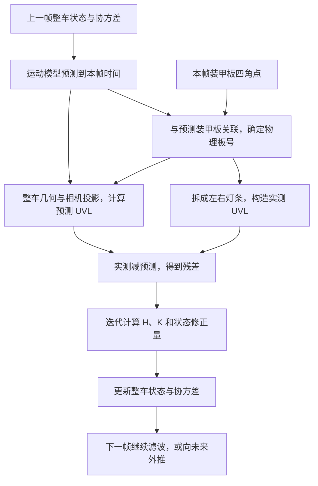

# newvision 如何预测：UVL 观测与整车滤波器的配合

本文按当前工作区代码整理（2026-09-05），重点解释 `EskfTracker → EskfTarget → ErrorStateEkf` 这条实际使用的链路，最后说明滤波结果如何用于未来位置预测。

`newvision` 用检测到的灯条几何信息，持续校正一个 **13 维整车状态**；这个状态包含车心位置、速度、姿态、自转角速度、装甲板半径和高度差。随后，程序根据平动速度推进车心、根据角速度推进姿态，得到未来每块装甲板的位置。

其中，**UVL 是观测的表达方式，IESKF 是融合观测与运动先验的滤波器**。IESKF 即迭代误差状态扩展卡尔曼滤波器。两者通过一个“整车状态 → 预测灯条图像”的观测函数连接起来。

## 1. 先把一帧里的数据流串起来



这里需要区分三件事：

| 环节 | 解决的问题 | 主要代码 |
| --- | --- | --- |
| 关联 | 这次检测对应整车模型里的哪块板、哪根灯条？ | `matchArmor()`、`matchLight()` |
| 观测更新 | 这根灯条的实测图像与预测图像有多大差异，整车状态该怎样修正？ | `UvlMeasure`、`updateMulti()` |
| 时间外推 | 按刚刚估计的运动状态，过一段时间整车会在哪里？ | `VehicleModel::Motion`、`EskfTarget::predict()` |

源码入口：[eskf_tracker.cpp](../src/l3_estimation/armor/eskf_tracker.cpp)、[eskf_target.cpp](../src/l3_estimation/armor/eskf_target.cpp)。

## 2. 滤波器里面保存的是什么

滤波器维护的是整车状态，所有关联到的装甲板共同约束这一份状态。

普通四板车的内部布局如下；表中的下标对应 `rawState()`：

| 下标 | 状态 | 含义 |
| --- | --- | --- |
| 0、2、4 | `CX, CY, CZ` | 车心／旋转参考中心在世界系的位置，单位 m |
| 1、3、5 | `VCX, VCY, VCZ` | 该中心的平动速度，单位 m/s |
| 6、11、12 | `ROT_Z, ROT_Y, ROT_X` | 整车姿态旋转向量的三个分量，单位 rad |
| 7 | `VYAW` | 绕车体自身 z 轴的角速度，单位 rad/s |
| 8 | `LOG_R1` | 第一组装甲板半径的自然对数 |
| 9 | `LOG_R2` | 第二组装甲板半径的自然对数 |
| 10 | `HEIGHT` | 奇数号板相对偶数号板的高度差，单位 m |

姿态由 `Exp([ROT_X, ROT_Y, ROT_Z])` 转成旋转矩阵。这三个数是旋转向量，不能直接当成欧拉角 roll、pitch、yaw；车辆存在倾斜时，这个区别会影响投影。

半径通过 `r = exp(LOG_R)` 取出，保证为正。对外的 `ekf_x()` 会将对应槽位转换成线性半径；四板车的第 9 项是第二组半径 `r2`，不能按旧模型读成 `r2-r1`。前哨站另有槽位复用：第 9、10 项表示另外两块板的高度偏移。

名义状态 `x` 就是当前的整车状态估计。滤波器还保存 `13 × 13` 的误差协方差 `P`，它既表达每个状态量有多不确定，也表达状态量之间的相关性。后者正是“图像观测能够更新速度”的关键。

源码：[vehicle_model.hpp](../include/l3_estimation/armor/vehicle_model.hpp)，重点看 `idx`、`vehicleRotation()` 和 `armorPose()`。

## 3. 一根灯条怎样变成 UVL 观测

一根灯条输入两个图像端点：

```text
top    = (u_t, v_t)
bottom = (u_b, v_b)
```

`uvlMeasurementFrom()` 调用 `pointsToObservation()`，得到一个四维向量。代码里的顺序固定为：

```text
z = [α, u, v, L]ᵀ

α = atan2(u_t - u_b, v_t - v_b)
u = (u_t + u_b) / 2
v = (v_t + v_b) / 2
L = sqrt((u_t - u_b)² + (v_t - v_b)²)
```

| 分量 | 意义 | 单位 |
| --- | --- | --- |
| `α` | 灯条方向角，注意 `atan2` 的参数顺序 | rad |
| `u, v` | 灯条中心的图像坐标 | px |
| `L` | 灯条像素长度 | px |

尽管叫 UVL，当前观测还包含方向角，因此实际是四维。

图像 v 轴向下，代码取的是 `top-bottom`。所以一根竖直灯条的原始 `α` 会在 `±π` 附近。预测与实测共用同一个转换函数，角度残差再归一化，因此不会因跨越 `±π` 而产生接近 `2π` 的假误差。

一块完整装甲板的角点顺序是“左上、右上、右下、左下”，拆分方式是：

```text
左灯条 = points[0], points[3]
右灯条 = points[1], points[2]

一块完整板 → 两根灯条 → 两个 4 维 UVL 观测
```

因此，即使没有独立灯条检测，只要 L2 给出了完整装甲板的四角点，UVL 更新就能工作。

源码：[uvl_measure.hpp](../include/l3_estimation/armor/uvl_measure.hpp)，重点看 `pointsToObservation()`、`uvlMeasurementFrom()`。

## 4. 整车状态怎样生成“预测 UVL”

滤波器需要一个观测函数 `h(x)`：假设当前整车状态正确，相机应该看到怎样的灯条？

`UvlMeasure` 持有 `UvlContext`，其中包括物理板号 `id`、左右灯条标记 `is_left`、板数、装甲板尺寸、相机内参、畸变系数，以及本帧相机在世界系中的位姿。这些量为本次观测提供几何条件。

### 4.1 从车心展开指定装甲板

设车心为 `c`，车体到世界系的旋转矩阵为 `C`，车辆共有 `N` 块板：

```text
θ_i = 2πi / N

普通四板车：
  i 为偶数：r_i = r1，h_i = 0
  i 为奇数：r_i = r2，h_i = height_diff

第 i 块板在车体系的位置：
b_i = [-r_i cosθ_i, -r_i sinθ_i, h_i]ᵀ

第 i 块板在世界系的位置：
p_i = c + C b_i

第 i 块板到世界系的旋转：
C_i = C Rz(θ_i) Ry(armor_pitch)
```

代码里的板系 x 轴指向车心，朝外的正面是 `-x` 侧，所以位置公式前面有负号。常规车的 `armor_pitch` 为 `+15°`，前哨站为 `-15°`。

板号改变时，改变的是同一整车状态的几何展开方式；这使旋转中的装甲板切换可以继续约束同一个车体模型。

### 4.2 从板位姿投影灯条端点

设装甲板宽、高为 `w, h`。灯条端点在板系中的坐标由实物尺寸确定：

```text
左灯条：top = (0, +w/2, +h/2)，bottom = (0, +w/2, -h/2)
右灯条：top = (0, -w/2, +h/2)，bottom = (0, -w/2, -h/2)

T_camera_armor = inverse(T_world_camera) * T_world_armor
p_camera      = T_camera_armor * p_armor
```

将相机系端点 `(Xc, Yc, Zc)` 做透视投影，再应用畸变和内参，就得到预测端点。忽略畸变时，关系是：

```text
u = fx * Xc/Zc + cx
v = fy * Yc/Zc + cy
```

实际实现还计算径向与切向畸变。预测端点随后进入与实测端点相同的 `pointsToObservation()`，得到：

```text
z_hat = h(x) = [α_hat, u_hat, v_hat, L_hat]ᵀ
```

相机姿态与图像必须对应同一时间，否则云台运动会表现成错误的灯条残差，进而污染目标状态。runtime 按图像时间调用 `gimbalPoseAt(timestamp)` 查询姿态；查询超出姿态历史范围时，当前实现取历史端点值。

源码：[uvl_measure.hpp](../include/l3_estimation/armor/uvl_measure.hpp) 的 `projectPointsOf()`，以及 [projection.hpp](../include/l6_telemetry/projection.hpp)。

### 4.3 这些图像量怎样约束三维状态

灯条中心的移动提供图像位置约束；灯条长度、左右灯条间距提供尺度与深度线索；两根灯条各自的方向、长度差和位置关系提供姿态线索。

这些约束是耦合的。例如，预测灯条偏短，可能来自距离偏远，也可能来自姿态偏差。滤波器会结合全部灯条、状态之间的相关性和历史运动先验共同求修正量。不能把某一个残差分量机械地指定给某一个状态量。

UVL 只是将端点换成便于理解、分别配置噪声的四个几何量；从两个二维端点变成四维 UVL，并没有凭空增加观测信息。

## 5. 新观测进入前，滤波器先预测到本帧

`EskfTracker::updateTarget()` 先调用 `predictEkf(timestamp)`，再做关联和观测更新。

设上一帧状态时刻为 `t_prev`，本帧为 `t_image`：

```text
dt = t_image - t_prev

车心：c_minus = c_prev + v_prev * dt
速度：v_minus = v_prev
姿态：C_minus = C_prev * Exp([0, 0, ω*dt]ᵀ)
角速：ω_minus = ω_prev
```

这是恒速度平移、绕车体 z 轴恒角速度旋转的模型。半径和高度差的名义值通常保持，实际代码还包括半径约束、前哨站固定转速等特殊处理。

同时，误差协方差推进为：

```text
P_minus = F P_prev Fᵀ + Q
```

`F` 描述状态误差如何随运动传播；`Q` 表达未建模加速度、角加速度和几何漂移带来的不确定性。当前 `F` 通过 `ceres::Jet` 对误差状态传播链求导。

这一步得到本帧更新前的先验 `x_minus, P_minus`。后面的 UVL 观测负责修正它们。

这里的“本帧时刻”指传入的图像时间戳。当前海康与迈德威视驱动在取到 SDK 图像缓冲后用主机时钟打戳，还没有把它严格换算成硬件曝光中点；时间同步精度会直接影响观测与预测是否对齐。

## 6. 先关联，再把观测装进滤波器

### 6.1 为什么需要物理板号

同一根检测灯条若配给 0 号板左灯条、1 号板右灯条，会得到完全不同的 `h(x)`。滤波更新以前，必须确定它对应哪一个几何部件。

当前完整装甲板关联流程是：

1. 保留与跟踪目标类别相同的检测。
2. 根据先验整车状态生成候选板，按朝向相机的程度保留最多三块。
3. 将候选板投影成四边形，与检测四边形计算中心误差、边方向误差和周长比例误差。
4. 超出门限的组合排除，其余做贪心一对一匹配。

关联门限决定观测是否进入更新；观测协方差 `R` 决定进入以后占多大权重，两者承担不同职责。

### 6.2 一次更新可以包含多少维观测

`EskfTarget::update()` 为每根灯条创建一个观测对象：

```cpp
Filter::makeObs<4>(z, measure, update_R, residual_func)
```

这四个部分分别提供实测 UVL、观测函数 `h(x)`、噪声协方差和残差算法。最后一次性调用 `filter_->updateMulti(observations)`。

观测按以下顺序拼接：完整板拆出的灯条、可选的单板深度差、独立灯条。

| 本帧观测组合 | 总维数 m | H 的尺寸 | K 的尺寸 |
| --- | --- | --- | --- |
| 一块完整板，仅 UVL | 8 | `8 × 13` | `13 × 8` |
| 一块完整板，加深度差 | 9 | `9 × 13` | `13 × 9` |
| 两块完整板 | 16 | `16 × 13` | `13 × 16` |
| 一块完整板、深度差、另一根独立灯条 | 13 | `13 × 13` | `13 × 13` |

一般而言，`m = 4 × 灯条数 + 可选深度差的1维`。13 个观测分量不保证 13 个状态都能独立确定，还要看几何是否退化以及 `H` 的秩。

### 6.3 PnP 在这条链路里的作用

初始化时，`single_pnp()` 提供第一块板的位姿，程序将它标为 0 号板，结合半径先验反推车心。普通车默认初始半径为 `0.26 m`，初始速度、角速度为零，后续通过跨帧更新估计。

正常跟踪主要使用上述 UVL。当本帧只关联到一块完整板时，程序还尝试从 IPPE 得到一维辅助观测：

```text
z_depth = 左灯条中心的相机深度 - 右灯条中心的相机深度
```

`DepthDiffMeasure` 从整车状态预测同一深度差，残差仍是实测减预测。这个量补充斜视姿态约束。PnP 失败时不加入这 1 维，完整板的 UVL 仍可更新；两块及以上完整板时不加入这项。

深度差由同一块板的图像角点导出，与其 UVL 可能相关；当前块对角 `R` 没有表达这类跨观测相关性。

### 6.4 独立灯条的使用条件与入口区别

独立灯条通过长度、方向和位置门限与模型中的灯条关联，并作为额外的四维 UVL 加入同一次更新。当前要求本帧至少关联到一块完整装甲板；基地目标不使用独立灯条辅助，完全没有完整板时不会靠独立灯条单独更新。

当前两个入口的接线情况是：

- `AutoAimRuntime` 调用 `detect(frame)` 和不带 `lights` 的 `track()`，使用完整板拆出的 UVL。
- `daedalus_vehicle_prediction` 调用 `detectFrame()` 获取完整板和独立灯条，并把两者传给 `track()`，可使用额外灯条观测。

因此，是否有独立灯条辅助，需要同时看配置与调用入口。

## 7. R 怎样表达“这次观测有多可信”

`R` 是观测噪声协方差，和描述整车状态误差的 `P` 位于不同空间。UVL 的角度单位是 rad，其余是 px；这些量通过 `R` 获得各自的权重。

设本根灯条的实测长度为 `L`，噪声缩放系数为 `s`。完整板拆出的灯条取 `s=1`，独立灯条取 `isolated_light_sigma_scale`。当前默认配置是：

```text
σ_center = sigma_pixel_by_length  * L * s = 0.2 * L * s
σ_length = sigma_length_by_length * L * s = 0.5 * L * s
σ_angle  = sigma_angle                * s = 0.1 * s
```

默认 `sigma_perp_px = -1`，采用中心误差各向同性分支：

```text
R_light = diag(σ_angle², σ_center², σ_center², σ_length²) / 2
```

对于 `L=20 px`、`s=1`：

```text
σ_center = 4 px，σ_length = 10 px，σ_angle = 0.1 rad
R_light  = diag(0.005, 8, 8, 50)
```

这些是方差，所以实际标准差还要对 `R` 的对角元素开平方。当前 `addLight()` 中 `split` 固定为 `2.0`，完整板灯条和独立灯条都做这一除法。

应把 `/2` 理解成当前实现采用的噪声设定。将一块板拆成两根灯条，本身不会推出“每根灯条的测量方差必须减半”；多根灯条的信息已经会在联合更新中通过各自的 `H` 和 `R` 汇入。

如果 `sigma_perp_px > 0`，灯条中心改用各向异性噪声：沿灯条方向取 `σ_parallel = 0.2*L*s`，垂直灯条方向取固定像素噪声 `σ_perp = sigma_perp_px*s`。

```text
e_parallel = [sinα, cosα]ᵀ
e_perp     = [cosα, -sinα]ᵀ

R_uv = (σ_parallel² e_parallel e_parallelᵀ
      + σ_perp² e_perp e_perpᵀ) / 2
```

这时 `u,v` 之间通常存在非零协方差。各根灯条及深度差之间仍按块对角方式拼接：

```text
R_all = blockdiag(R_light_0, R_light_1, R_depth?, R_isolated_0, ...)

R_depth = armor_lights_depth_diff_sigma² / 2
```

增大某类观测的 `R`，通常会降低滤波器对该类残差的响应；增大运动过程噪声 `Q`，通常会使先验更不确定、更愿意接受新观测。实际修正方向和大小仍取决于整个 `P、H、R`，并非单一权重。

## 8. 残差怎样变成整车状态的修正量

这是 UVL 与滤波器配合的核心。以下对应 [error_state_ekf.hpp](../include/l3_estimation/filter/error_state_ekf.hpp) 中的 `updateMulti()`。

### 8.1 先计算图像残差

```text
e = z - h(x)
e_angle = normalizeAngle(α - α_hat)
```

例如，一根灯条的实测与预测端点为：

```text
实测：top=(100,90)，bottom=(100,110)
预测：top=(98,91)， bottom=(98,109)

z     = [π, 100, 100, 20]ᵀ
z_hat = [π,  98, 100, 18]ᵀ
e     = [0,   2,   0,  2]ᵀ
```

这表示实测中心比预测向右 `2 px`、实测长度比预测长 `2 px`。修正整车状态需要知道：车心、姿态或半径稍微变化时，预测 UVL 会怎样变化？这由 `H` 回答。

### 8.2 H 是整车误差到图像变化的局部映射

用 `δ` 表示 13 维误差状态，`⊞` 表示把误差注入名义状态：

```text
x_eval = x_minus ⊞ δ
H      = ∂h(x_minus ⊞ δ) / ∂δ
```

`H` 的一列对应某个状态误差的影响，一行对应某个观测分量。例如，车心横向位置变化会影响灯条的 `u`；车体转动会同时影响两根灯条的位置、长度与方向。

当前观测更新用中心差分计算 `H`，每个误差维度的扰动量为 `ε=1e-6`：

```text
H[:, j] ≈ -[e(δ + ε e_j) - e(δ - ε e_j)] / (2ε)
```

这里 `e_j` 表示第 j 维的单位向量。前面的负号来自残差定义 `e=z-h(x)`。代码差分的是经过角度归一化的残差，避免预测角度跨越 `±π` 时产生假梯度。

运动预测的 `F` 使用自动微分；这里的观测 `H` 使用数值差分，两者不要混淆。

### 8.3 K 综合先验、几何敏感度与观测噪声

同帧所有观测的残差和 `H` 纵向堆叠，`R` 按块对角拼接，然后计算：

```text
S = H P_minus Hᵀ + R
K = P_minus Hᵀ S⁻¹
```

`S` 表示预测观测与测量噪声共同造成的残差不确定性。`K` 把图像空间的残差映射到状态空间：m 维残差，经 `13 × m` 的增益矩阵，变成 13 维状态修正量。实际代码通过 LDLT 解线性方程，不显式求逆。

像素残差之所以能修正以米、米每秒、弧度表示的状态，是因为 `H` 描述了投影的单位转换和敏感度，`P` 与 `R` 又给出了对应的不确定性。

### 8.4 同一帧为什么要迭代

观测函数包含旋转、透视除法、畸变和 `atan2`。先验偏离观测时，一次线性化可能不够，所以每轮在新的误差估计处重新计算预测 UVL、残差、`H` 和 `K`。

当前默认的迭代式是：

```text
δ_0 = 0

第 j 轮：
  x_j     = x_minus ⊞ δ_j
  e_j     = residual(h(x_j), z)
  H_j     = 在 δ_j 处求观测雅可比
  K_j     = P_minus H_jᵀ (H_j P_minus H_jᵀ + R)⁻¹
  δ_(j+1) = K_j (e_j + H_j δ_j)
```

`ieskf.iteration_num` 默认是 `5`。当前实现固定执行配置的轮数，没有根据残差大小提前退出。

迭代期间，实测 `z`、关联到的板号和先验 `P_minus` 保持不变；变化的是线性化位置。`H_j δ_j` 让修正量始终相对于同一个先验计算。它可以理解为在以下目标上做局部迭代：

```text
J(δ) = δᵀ P_minus⁻¹ δ
     + residual(h(x_minus ⊞ δ), z)ᵀ R⁻¹
       residual(h(x_minus ⊞ δ), z)
```

第一项约束偏离运动先验的程度，第二项约束图像拟合误差。五轮迭代是在反复改进同一帧的解，而非把这张图当五次独立测量。

代码还保留 `δ += K*e` 的可选分支，但默认 `textbook_iteration_ = true`，当前 `EskfTarget` 没有切换到那个分支。

### 8.5 最后怎样写回状态和协方差

迭代结束后，将最终误差注入名义状态：

```text
x_plus = x_minus ⊞ δ_final

普通数值分量：相加
姿态：C_plus = C_minus * Exp(δ_rotation)
半径：先更新 log(r)，读取时再 exp()
```

姿态使用右乘旋转更新，所以误差转动在车体系中表达。然后清零误差状态，用最后一轮的 `K、H、R` 更新协方差：

```text
P_plus = (I-KH) P_minus (I-KH)ᵀ + K R Kᵀ
P_plus = (P_plus + P_plusᵀ) / 2
```

这是当前代码采用的 Joseph 形式及对称化操作。协方差只在循环结束后更新一次，下一帧从新的状态和协方差继续预测。

## 9. UVL 没有速度，为什么能估出速度

`UvlMeasure` 对应的观测函数 `h(x)` 直接使用车心、姿态、半径和高度差，不直接读取平动速度或 `VYAW`。因此单帧观测雅可比中，这些速度维度的列为零。

速度更新来自预测步骤建立的相关性：

```text
位置预测依赖速度 → P 中出现位置—速度相关性
姿态预测依赖角速 → P 中出现姿态—角速度相关性

图像约束位置／姿态 → K 利用上述相关性，同时修正速度／角速度
```

用一个只保留位置 `p` 和速度 `v` 的教学例子说明。假设某个图像中心分量对位置的导数为 `2 px/m`，本帧先验和观测为：

```text
x = [p, v]ᵀ
P_minus = [1.0  0.3]
          [0.3  2.0]
H = [2, 0]
R = [1]
图像残差 e = 2 px

S = H P_minus Hᵀ + R = 5
K = P_minus Hᵀ / 5 = [0.40, 0.12]ᵀ

δp = 0.40 * 2 = 0.80 m
δv = 0.12 * 2 = 0.24 m/s
```

这是为了展示矩阵关系而选的数字。即使 `H` 的速度列是零，`P` 的位置—速度交叉项也能使速度对应的增益非零。三维整车中的平动速度、自转角速度，沿着同样的机制被跨帧观测修正。

这也解释了初始化后需要积累观测：第一张图能给几何初值，稳定的运动估计来自后续的预测与更新。

## 10. 滤波结果如何用于未来预测

`EskfTracker::track()` 向下游返回 `snapshot()`，其中包含名义状态与时间戳，不包含内部滤波器。下游的 `predict()` 只推进这份状态及其时刻，不传播内部协方差。

对普通车辆，向前预测 `Δt` 的主要公式仍是：

```text
c_future = c_now + v_now * Δt
C_future = C_now * Exp([0, 0, ω*Δt]ᵀ)

p_i_future = c_future + C_future b_i
```

在车体水平、只绕竖直轴转动的简化情形下：

```text
ψ_future = ψ_now + ω*Δt
θ_i      = ψ_future + 2πi/N

x_i = cx_future - r_i*cosθ_i
y_i = cy_future - r_i*sinθ_i
z_i = cz_future + h_i
```

例如，先固定 0 号板看几何：车心为 `(5,0,0) m`、速度为 `(0,1,0) m/s`、初始 yaw 为 0、角速度为 `10 rad/s`、半径为 `0.26 m`。经过 `100 ms`：

```text
车心从 (5,0,0) 变成 (5,0.1,0)
车体转过 1 rad，约 57.3°
0 号板从 (4.74,0,0) 变成约 (4.8595,-0.1188,0)
```

车心向正 y 方向移动，这块板却因旋转移向负 y 方向。必须同时推进平移与旋转，才能得到这样的结果。

下游两个入口使用不同的预测时长：

| 入口 | 预测时长如何确定 | 输出 |
| --- | --- | --- |
| `daedalus_vehicle_prediction` | `--predict-ms` 指定，默认从目标状态时刻向前 100 ms | 绿色当前整车与橙色未来整车 |
| `AutoAimRuntime → Planner` | 图像到发射的延迟，加弹丸飞行时间 | 命中点、实体板号和 yaw/pitch |

实机规划使用：

```text
before_fire = image_to_plan + plan_to_send
            + send_to_control + control_to_fire

t_hit = target.t() + before_fire + fly_time
```

`Planner` 先外推到发射时刻，再根据飞行时间外推到命中时刻并重新选板、解弹道。飞行时间依赖目标位置，所以循环求解，当前默认最多 10 轮、相邻飞行时间差小于 1 ms 时退出。达到上限时保留最后一轮解，没有单独的“未收敛”拒绝状态。当前每轮会重新选板，弹道用 `planner.cpp` 内的真空解析解。

这里的时间链仍有实现上的近似：`image_to_plan` 依赖前述图像时间戳口径；`plan_to_send` 用上一帧从规划开始到 runtime 计时点的耗时估计，计时包含启用时的叠加绘制，串口线程实际写出的时刻没有直接回灌。预测效果同时受状态估计和时间链精度影响。

源码：[predictor.cpp](../src/l4_planning/armor/predictor.cpp)、[planner.cpp](../src/l4_planning/armor/planner.cpp)、[auto_aim_runtime.cpp](../src/runtime/auto_aim_runtime.cpp)。

## 11. 阅读日志和配置时要注意什么

当前 runtime 创建的是 `EskfTracker`，使用 [auto_aim.yaml](../config/auto_aim.yaml) 中的 `ieskf` 参数。文件里仍保留旧的 `estimator` 和 `tracker` 参数，但这条 IESKF 运行链路没有将它们作为自身噪声和生命周期配置。

| 参数或现象 | 应怎样理解 |
| --- | --- |
| `ieskf.iteration_num` | 一帧观测重新线性化的轮数，默认 5；与 L4 飞行时间迭代无关 |
| `body_acceleration`、`yaw_acceleration` | 影响运动先验的过程噪声；默认 `[30,30,1]` 和 `30` |
| `sigma_pixel_by_length`、`sigma_length_by_length`、`sigma_angle` | 分别影响灯条中心、长度与方向的观测权重 |
| `sigma_perp_px` | 大于 0 才启用灯条中心的各向异性噪声；当前配置为 -1 |
| 关联板号反复变化、车体姿态突跳 | 先检查完整板的几何关联与角点质量 |
| 灯条中心／长度／方向残差偏大 | 分开看位置、尺度、姿态相关问题；这些量耦合，不能一项残差唯一定位原因 |
| 没有完整板匹配，进入 `TempLost` | 继续按运动模型预测，缺少本帧 UVL 修正；L5 拒绝开火 |
| 预测框越来越偏 | 同时检查关联、标定、图像与姿态同步，以及恒速度模型是否适合当前运动 |

`lastUvlUpdateLights()` 是本帧实际送进多观测更新的灯条列表，可以用来核对检测结果究竟有没有参与滤波。

`converged()` 当前按累计观测块数大于 20 且状态未发散来置位。一根灯条算一个四维观测块，单板深度差也算一个观测块；它不是“连续 20 帧”，也不是严格的统计收敛证明。

NIS 的计算形式是 `eᵀ S⁻¹ e`，但当前 `updateMulti()` 保存的是最后一轮线性化时的残差和 `S`。因此，虽然附近注释提到了先验创新，实际 `lastNis()` 并非更新前的先验 NIS，也不等同于最终注入后重新计算的残差。不要直接按“先验 NIS 的自由度等于观测维数”来解释这组日志；当前 Tracker 也没有用它作为观测拒绝门限。

## 12. 按这个顺序读代码

| 顺序 | 文件与函数 | 阅读重点 |
| --- | --- | --- |
| 1 | [uvl_measure.hpp](../include/l3_estimation/armor/uvl_measure.hpp)：`pointsToObservation()` | 两个端点怎样变成四维实测 UVL |
| 2 | 同文件：`projectPointsOf()`、`operator()`、`residual()` | 整车状态怎样产生预测 UVL，再算残差 |
| 3 | [vehicle_model.hpp](../include/l3_estimation/armor/vehicle_model.hpp)：`armorPose()`、`Motion` | 装甲板几何与时间推进模型 |
| 4 | [eskf_target.cpp](../src/l3_estimation/armor/eskf_target.cpp)：`update()` 内的 `addLight` | 观测对象和 `R` 怎样组装，哪些观测参与更新 |
| 5 | [error_state_ekf.hpp](../include/l3_estimation/filter/error_state_ekf.hpp)：`updateMulti()` | 堆叠 `H/R`，迭代求 `δ`，更新 `P` |
| 6 | [eskf_tracker.cpp](../src/l3_estimation/armor/eskf_tracker.cpp)：`updateTarget()` | 预测、关联、深度差和更新的调用顺序 |
| 7 | [planner.cpp](../src/l4_planning/armor/planner.cpp)：`planTarget()` | 如何把滤波得到的运动状态用于命中预测 |

已有的 [ESEKF 与 UVL 移植笔记](esekf_uvl_port.md) 包含更长的数学与上游实现拆解；涉及当前迭代分支、噪声取值和调用入口时，应结合本文对应的现有源码阅读。
